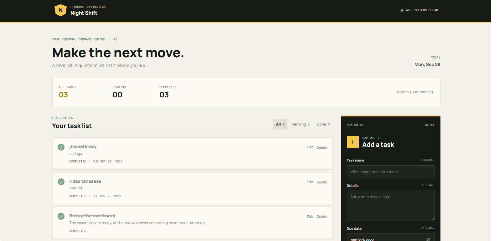
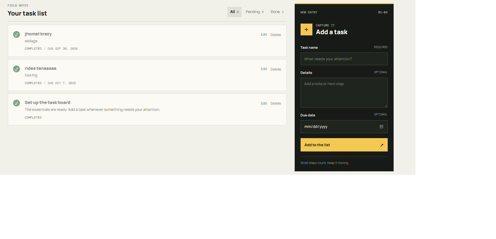
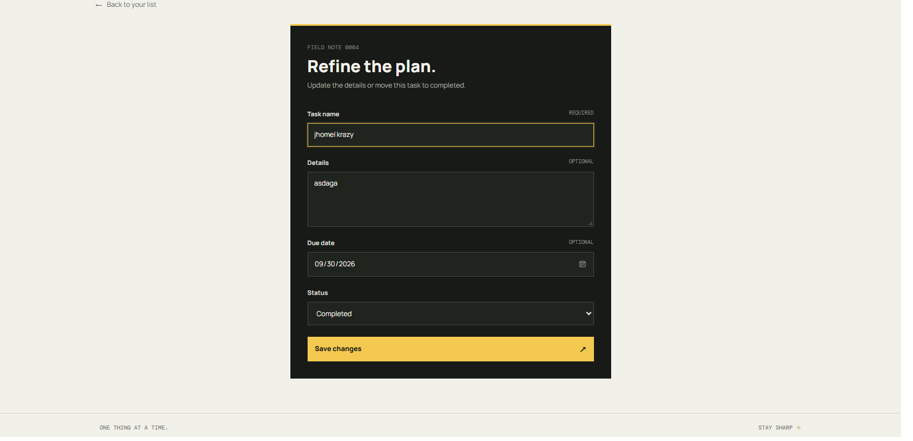
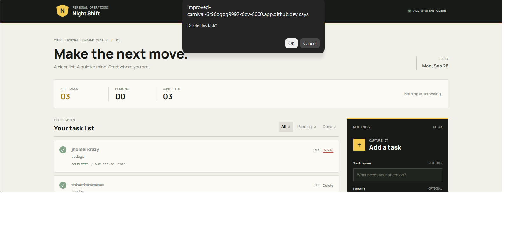

# bentazal_taskmanager

- Project Code: WST21-PM-2026-SF
- Student Name: Jhomel Bentazal
- Course & Year: BSIT-2
- Database Used: SQLite

## Features

- Add tasks with optional details and due dates
- View and filter tasks by status
- Edit or delete tasks
- Mark tasks as pending or completed

## Screenshots and Walkthrough

Follow the screenshots in order to see the main task-management flow:

### 1. Open the task dashboard

The dashboard shows your task list and totals for all, pending, and completed tasks. Use the filters above the list to switch between all tasks, pending tasks, and completed tasks.

### 2. Add a task

In the **Add a task** panel, enter a task name. You can also add details and choose a due date, then select **Add to the list**.

### 3. Review and update task status

New tasks appear in the task list with their details and status. Select the status control beside a task to mark it completed; select it again to return it to pending. Use **Edit** to change its information or **Delete** to remove it.

### 4. Edit a task

Select **Edit** beside a task to open its edit form. Update the task name, details, due date, or status, then select **Save changes** to apply your changes.

